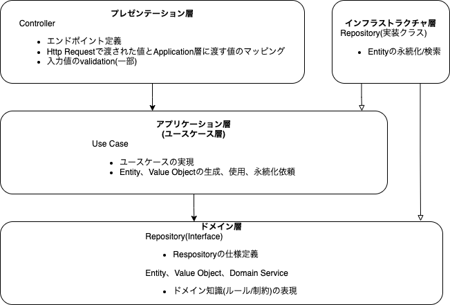

# リポジソトリ

https://github.com/yuyaamano23/todo-app-by-node

# コンテナ起動

```
docker-compose up
```

# ターミナルからDB操作

```
docker-compose exec db mysql -uroot -pexample
```

# 依存関係


引用：https://zenn.dev/ayumukob/articles/ff183004d09ede#%E4%B8%80%E8%88%AC%E7%9A%84%E3%81%AA%E5%B1%A4%E3%81%AE%E8%B2%AC%E5%8B%99


- プレゼンテーション層 (Controller): アプリケーション層（TaskService）に依存。
- アプリケーション層 (ユースケース層): ドメイン層（TaskRepositoryインターフェース、Taskエンティティ）に依存。
- ドメイン層: 他のレイヤーに依存せず、エンティティやリポジトリインターフェースを定義。
- インフラストラクチャ層: ドメイン層（TaskRepositoryインターフェース、Taskエンティティ）に依存し、具体的なリポジトリ実装を提供。

# curlコマンド

## 参照

```sh
curl http://localhost:3000/tasks
```

## 作成

```sh
curl -X POST http://localhost:3000/tasks \
     -H "Content-Type: application/json" \
     -d '{"title": "New Task", "description": "This is a new task"}'
```

## 削除

```sh
curl -X DELETE http://localhost:3000/tasks/1
```
